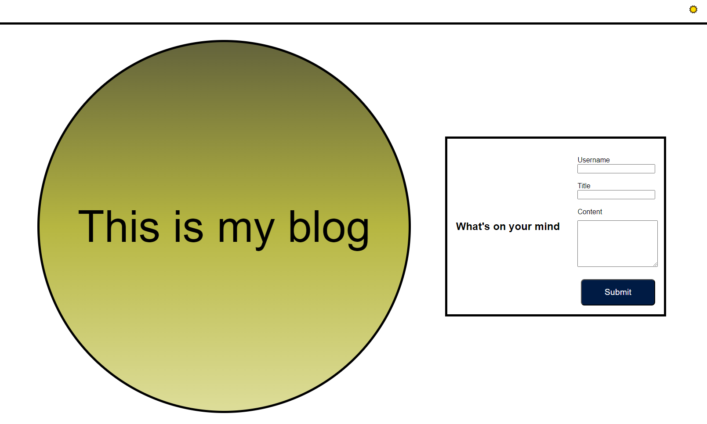
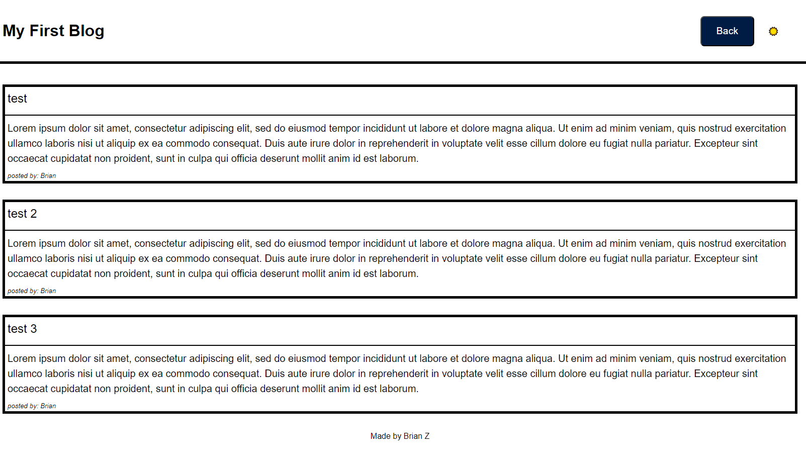

# Blog

## Introduction
This is a blog page made with JS, HTML, and CSS.

The project contains two HTML pages, one to take user inputs and other to display those inputs. Index.html takes the users Username, title of the blog post, and the content of the blog post. On both pages, there is a a button that allows the user to change the theme to a light or dark theme.

## Mock Up
An example of what the index page will look like

An example of what the blog page will look like

## Code Break down
The three js files are as listed
* `form.js`: This file will get the user inputs and store into local storage and then move to the blog page. It will also check whether input elements are empty and will not move on if any field is left blank. To prevent localStorage.setItem from replacing previous blog post data, form.js will get the item from local storage before taking in any user input.
* `blog.js`: This file will render the blog page. Using the stored data from form.js, this file will create a ul, a, and a li element for each input and append it to the appropriate element. Blog.js also includes a button function to go back to index.html
* `logic.js`: This file will change the theme when the button is pressed, and store the theme data, so that the theme is remembered even when the page is changed or refreshed. The init function is ran when a page loads and will get theme data from local storage and change the theme to the stored theme data. If there is no theme data, then it will default to light mode. The button will change the theme and store the data.

## Page
[This is the link to the blog](https://heropon1k.github.io/Blog/)